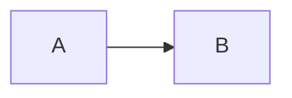

# 数学公式

$$
\int_a^bf(x)dx
$$

$$
x = {-b \pm \sqrt{b^2-4ac} \over 2a}
$$

# Mermaid

# 图片

# Footnote

这是一个脚注[^1],这是另外一个脚注[^2]

[^1]: 能成功吗
[^2]: 应该可以成功吧

# Links

[Google](https://google.com)

# 嵌入视频

<video controls width="80%">
  <source src="/assets/videos/樊振东.mp4" type="video/mp4">
</video>

## 引入外部视频

###  Bilibili


【【樊振东】“多少次迎着冷眼与嘲笑，从没有放弃过心中的理想。”】 https://www.bilibili.com/video/BV1fkYNesEiv/?share_source=copy_web&vd_source=57d93991f103db1cf0bd8737faea7e61

### Youtube



### 本地视频



# 嵌入音频



# 插注

> An example showing the `info` type prompt.
{: .prompt-info }

>这是一个紫色的自定义提示框。
{: .prompt-tip }

> 这是一个橙色的自定义提示框。
{: .prompt-warning }

>这是一条信息提示。
{: .prompt-info }

> Add Markdown syntax content to file `_tabs/about.md`{: .filepath } and it will show up on this page.
{: .prompt-tip }

